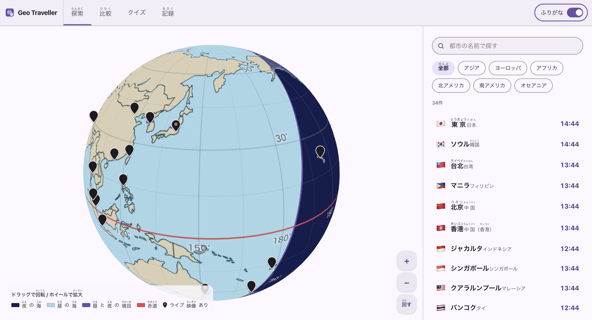
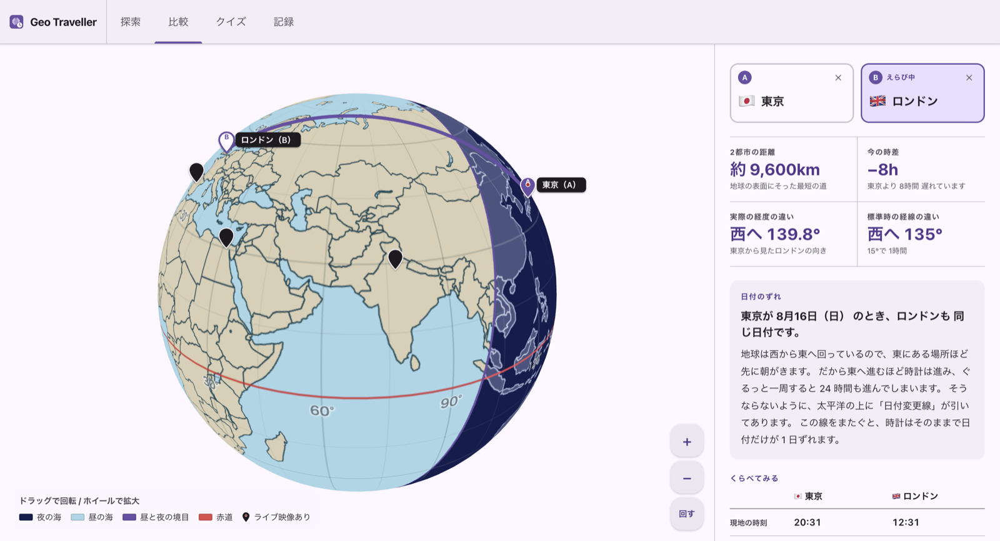
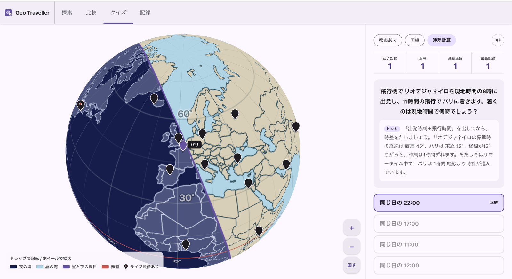
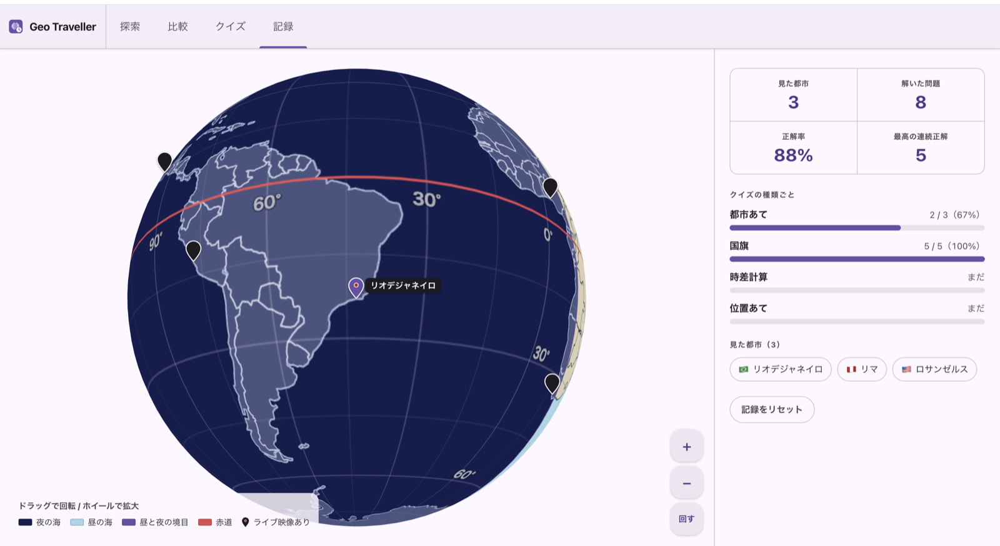

# Geo Traveller

3D の地球儀を回しながら、世界の都市の「今の時刻」「時差」「位置」を学べる学習 Web アプリです。

小学生〜中学生を対象に、UI とコンテンツはすべて日本語。漢字にはふりがな（ルビ）をワンタップで出し入れできます。地球儀には昼と夜の境界をリアルタイムに描画します。


## 機能

### 探索

- ドラッグで回転、ピンチ・ホイール・ボタンで拡大縮小できる 3D 地球儀。矢印キーと `+` `-` でも操作でき、自動回転の ON / OFF も切り替え可能
- 昼夜の境界線（ターミネーター）をリアルタイム描画し、夜の海・昼の海・赤道を色分け表示
- 都市のピンをタップすると、現地時刻・日付・日本との時差・人口・大陸・言語・通貨・豆知識を表示
- 都市名での検索と、大陸別（アジア / ヨーロッパ / アフリカ / 北アメリカ / 南アメリカ / オセアニア）の絞り込み
- ライブ映像が用意されている都市では、YouTube の配信をその場で再生

### 比較



- 2 都市を選ぶと、地球儀上に両都市を結ぶ大圏コースの弧を描画
- 距離 (km)、実際の経度の差、標準時の経線の差、現在の時差を並べて表示
- 人口・大陸・半球・経度・言語・通貨の比較表と、日付が 1 日ずれる理由の解説

### クイズ



難易度は出題ごとに変化し、間違えた問題は後で再出題されます。ヒントと、正解後の解説つき。

| 種類 | 内容 |
| --- | --- |
| 都市あてクイズ | 半球・大陸・人口・通貨のヒントから都市を当てる |
| 国旗クイズ | 国旗から国名、または主要都市を当てる |
| 時差計算クイズ | 2 都市の時刻や、飛行機の到着時刻（飛行時間＋時差）を計算する |
| 位置あてクイズ | 地球儀のピンをタップして場所を当てる |

### 記録



- 見た都市数・解いた問題数・正解率・最高連続正解数
- クイズ種類ごとの成績
- 訪れた都市の一覧（タップでその都市へ移動）
- 記録は `localStorage`（キー: `gtt-v1`）に保存され、いつでもリセットできます

## 技術スタック

- React 19 / TypeScript / Vite
- [three.js](https://threejs.org/) — 3D 地球儀の描画
- [topojson-client](https://github.com/topojson/topojson-client) — 国境データのメッシュ化
- [Vitest](https://vitest.dev/) — 時差計算やクイズ生成など、純粋関数のテスト（280 件）
- CSS Modules — コンポーネントごとのスタイル
- ESLint（`typescript-eslint` + React Hooks / React Refresh プラグイン）

## 外部データ

いずれもビルドに含めず、実行時に取得します。

| 用途 | 取得元 |
| --- | --- |
| 国境（TopoJSON） | `world-atlas@2/countries-110m.json` |
| 湖・海（GeoJSON） | Natural Earth `ne_110m_lakes` / `ne_110m_ocean` |
| ライブ映像 | YouTube 埋め込みプレイヤー |
| 時刻・時差 | ブラウザの `Intl.DateTimeFormat`（IANA タイムゾーン） |

## ディレクトリ構成

```
src/
├── data/        都市データと型定義
├── lib/         時差計算・座標変換など、画面を持たない純粋関数
├── globe/       three.js まわり（React の外側で描画ループを回す）
├── features/
│   ├── explore/   探索モード
│   ├── compare/   比較モード
│   ├── quiz/      クイズモード
│   ├── record/    記録モード
│   └── furigana/  ふりがなの対応表と、ルビを出す部品
└── components/  モードをまたいで使う UI
```

テストは対象と同じ場所に `*.test.ts` として置いています（`lib/time.ts` に対して `lib/time.test.ts`）。

`globe/` を React コンポーネントの外に置いているのは、地球儀が毎フレーム描画を続けるためです。都市ピンは three.js のオブジェクトではなく canvas に重ねた DOM 要素で、描画ループの中から直接 `left` / `top` を書き換えます。React の state 経由にすると毎フレーム再レンダリングが起きるので、この境界は保ちます。

## 対応環境

画面の幅に合わせて、パネルの置き場が 3 通りに変わります。

| 幅 | レイアウト |
| --- | --- |
| 1024px 以上 | 地球儀の右にパネル |
| 600〜1023px | 地球儀の下にパネル |
| 600px 未満 | 地球儀を小さくして、パネルを広く取る |

600px 未満で開いたときは、より大きい画面をすすめる案内を最初に表示します。閉じればそのまま使えます。

## セットアップ

Node.js 20.19 以上、または 22.12 以上が必要です。

```bash
npm install
npm run dev
```

`http://localhost:5173` が開発サーバーです。同じネットワークの実機で確認したいときは `npm run dev -- --host` で起動すると、LAN の IP アドレスでも開けます。

テストは次で走ります。

```bash
npm run test
```

## スクリプト

| コマンド | 内容 |
| --- | --- |
| `npm run dev` | 開発サーバーを起動 |
| `npm run build` | 型チェック（`tsc -b`）と本番ビルド |
| `npm run preview` | ビルド結果をローカルで確認 |
| `npm run test` | テストを実行（Vitest） |
| `npm run lint` | ESLint を実行 |
